# 🧩 User API

API RESTful para **registro y consulta de usuarios**, desarrollada con **Spring Boot**, **JPA** y **H2 (in-memory)**.  
Incluye validaciones de correo, contraseña y duplicidad de email.  
La documentación de la API está disponible mediante **Swagger UI**.

---

## 🚀 Requisitos

- **Java 17+**
- **Gradle** (o usar wrapper `./gradlew`)
- **Docker** (opcional)
- **Postman / cURL / Browser**

---

## ▶️ Cómo ejecutar localmente (sin Docker)

1. **Clonar el repositorio**
   ```bash
   git clone git@github.com:rodrigoGit-2014/UserAPI.git
   cd UserAPI
   ```

2. **Compilar y ejecutar**
   ```bash
   ./gradlew bootRun
   ```

3. **Verificar que la aplicación está corriendo**
   ```
   http://localhost:8080/actuator/health
   ```

4. **Acceder a la base de datos H2**
   ```
   http://localhost:8080/h2-console
   ```
    - **JDBC URL:** `jdbc:h2:mem:testdb`
    - **Usuario:** `sa`
    - **Password:** *(dejar en blanco)*

---

## 🧪 Swagger UI

Swagger UI permite explorar y probar las APIs directamente desde el navegador.

📍 URL:
```
http://localhost:8080/swagger-ui/index.html
```

Desde ahí podrás ejecutar los endpoints:
- `POST /api/v1/users`
- `GET /api/v1/users/{id}`

---

## 📡 Endpoints

### 1️⃣ **Registrar usuario**

**POST** `/api/v1/users`

#### Descripción
Registra un nuevo usuario.  
El flujo de este endpoint incluye:
1. Validar formato de correo.
2. Validar formato de contraseña.
3. Validar que el correo no esté duplicado.
4. Persistir el usuario y sus teléfonos en la base de datos.
5. Retornar los datos registrados.

#### Ejemplo de request

```json
POST http://localhost:8080/api/v1/users
Content-Type: application/json

{
  "name": "Rodrigo Cáceres",
  "email": "rodrigo@example.com",
  "password": "Abc12345",
  "phones": [
    {
      "number": "987654321",
      "citycode": "2",
      "contrycode": "56"
    }
  ]
}
```

#### Ejemplo de response

```json
{
  "id": "c342a7a2-f1e0-4b5d-8f44-f98e1eb1d2de",
  "created": "2025-11-08T16:30:01",
  "modified": "2025-11-08T16:30:01",
  "lastLogin": "2025-11-08T16:30:01",
  "token": "d3db3c9b-95b1-451d-8d41-cb8b30dbfc16",
  "isActive": true,
  "phones": [
    {
      "number": "987654321",
      "citycode": "2",
      "contrycode": "56"
    }
  ]
}
```

---

### 🌐 Diagrama del flujo de registro (`POST /api/v1/users`)

```mermaid
sequenceDiagram
    participant C as Cliente
    participant UC as UserController
    participant US as UserServiceImpl
    participant V as Validadores (Email, Password, Duplicate)
    participant M as UserMapper
    participant R as UserRepository
    participant DB as H2 Database

    C->>UC: POST /api/v1/users {UserRequestDto}
    UC->>US: register(request)
    US->>V: Ejecuta validaciones de correo, contraseña y duplicidad
    V-->>US: Validaciones OK
    US->>M: toEntity(request)
    M-->>US: UserEntity listo
    US->>R: save(UserEntity)
    R->>DB: Inserta usuario y teléfonos
    DB-->>R: Retorna UserEntity persistido
    R-->>US: UserEntity persistido
    US->>M: toResponse(UserEntity)
    M-->>US: UserResponseDto
    US-->>UC: Retorna respuesta
    UC-->>C: 201 Created + UserResponseDto
```



---

### 2️⃣ **Obtener usuario por ID**

**GET** `/api/v1/users/{id}`

#### Descripción
Obtiene un usuario previamente registrado a partir de su identificador UUID.

#### Ejemplo de request
```
GET http://localhost:8080/api/v1/users/7a53f9ee-05f1-47da-b1ab-43db8f54a198
```

#### Ejemplo de response
```json
{
  "id": "7a53f9ee-05f1-47da-b1ab-43db8f54a198",
  "created": "2025-11-08T16:30:01",
  "modified": "2025-11-08T16:30:01",
  "lastLogin": "2025-11-08T16:30:01",
  "token": "d3db3c9b-95b1-451d-8d41-cb8b30dbfc16",
  "isActive": true,
  "phones": [
    {
      "number": "987654321",
      "citycode": "2",
      "contrycode": "56"
    }
  ]
}
```

---

## 🐳 Ejecución con Docker

1. **Construir imagen**
   ```bash
   ./gradlew bootJar
   docker build -t user-api .
   ```

2. **Ejecutar contenedor**
   ```bash
   docker run -p 8080:8080 user-api
   ```

3. **Probar API**
   ```
   http://localhost:8080/swagger-ui/index.html
   ```

---

## 📘 Tecnologías utilizadas

- **Spring Boot 3.x**
- **Spring Data JPA**
- **H2 Database**
- **Spring Validation**
- **MapStruct**
- **Lombok**
- **Swagger / OpenAPI**
- **JUnit 5 + Mockito**

---

## 👨‍💻 Autor

**Rodrigo Cáceres Valdés**  
Backend Developer | Java & Spring Boot  
📧 rodrigocaceresv@gmail.com
